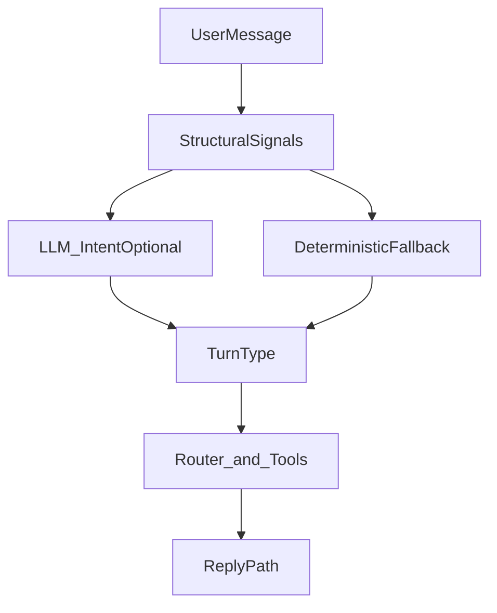

# Intent & Routing ohne Buzzword-Patches

## Problem

Heute steuern produktive Stellen das Agenten-Verhalten über wachsende **Substring-Marker**:

- [`post_fields.py`](backend/app/graphs/support/post_fields.py): `WEB_INQUIRY_*`, `MEMORY_INQUIRY_*`, `POST_STATUS_*`, `GENERATE_MARKERS`, `FIELD_BRIEFING_MARKERS`
- [`manager_agent.py`](backend/app/agents/manager_agent.py): `text_keywords` / `image_keywords` / `*_only_phrases`
- [`rag.py`](backend/app/graphs/nodes/rag.py): ReAct-Prompt mit Beispielphrasen
- [`routers.py`](backend/app/graphs/routers.py): Tool-Hits vs. Intent

Typischer Antipattern: Verhalten über ein Wort erzwingen → nächster Real-Turn kollidiert (Beispiel: `aktuell` in „aktuelle Saison“ → Websuche statt Steckbrief).

**Regel:** Keine Wörter nur deshalb in Listen aufnehmen, um ein gewünschtes Beispiel-Verhalten zu erzwingen.

## Zielbild

Turn-Typen (ein Turn = eine klare Absicht):

| Turn-Typ | Erwartetes Verhalten |
|---|---|
| `field_briefing` | Felder speichern, ggf. nächste Frage, **keine** Web/Memory-Antwort |
| `generate_*` | Completeness → Spezialisten; Web nur als Briefing-Kontext |
| `research_web` | Nur Web-Antwort |
| `research_memory` | Nur Memory-Antwort |
| `memory_store` | Speichern + Ack |
| `post_status` | Snapshot aus Post |
| `ambiguous` | Kurze Klärung (Text/Bild/beides?), keine Tools erzwingen |

Priorität (fest, dokumentiert):

1. expliziter Store / Status  
2. explizite Research-Frage (`?` / Interrogativ / „suche im Web“)  
3. Feld-Briefing (Labels / `awaiting_field` / Mehrfach-Zuweisung)  
4. Generier-Befehl  
5. sonst `ambiguous`

## Was bleiben darf (schmale Safety-Netze)

Nur **explizite Befehle**, die kaum in Briefings vorkommen:

- Speichern: `merk dir`, `speicher`, `remember`
- Web: `suche im web/internet`, `recherchier … online`
- Memory-Q: `was weißt du im rag/gedächtnis`
- Generate: klare Verben (`erstell`, `schreib`, `generier`, …) — Signal „wollen erzeugen“, nicht Themen-Matcher
- Nur-Text / Nur-Bild Phrasen

**Nicht** als alleinige Trigger: lose Inhaltswörter wie `aktuell`, `trend`, `heute`, `linkedin`, `post`, `bild` ohne Strukturkontext.

## Umsetzungsschritte

### 1. Inventar
Alle produktiven Marker/Patterns listen: Ort, Zweck, Kollisionsrisiko. Lose Inhaltswörter zum Entfernen markieren.

### 2. Strukturelle Signale
Classifier auf Struktur statt Wortlisten-Orakel:

- `is_question_message` schärfen
- `looks_like_field_briefing` behalten/verbessern (Feld-Labels, Zuweisungen) — kein Inhaltswort-Match
- `awaiting_field` aus Post-State hat Vorrang vor Research
- Generate nur bei Verb (+ optional Artefakt-Signal); bloßes „LinkedIn Post über …“ ohne Verb → `ambiguous`

### 3. LLM als Primary (optional, empfohlen)
Kurzer Intent-Call (JSON: `turn_type` + confidence) vor/statt Keyword-Orakel.

- Bei HF-Ausfall oder niedriger Confidence → deterministischer Fallback aus Schritt 2
- Prompt: Turn-Typen + Gegenbeispiele („aktuelle Saison im Textcontext = field_briefing, nicht web“)
- **Keine** langen Keyword-Listen im Prompt

### 4. Router & ReAct
- Tool-Hits (`web_search` / `memory_*`) dürfen `field_briefing` / `clarification_needed` nicht überschreiben
- `REACT_SYSTEM_PROMPT`: Regeln nach Turn-Typ, keine Buzzwords als Entscheidungsgrundlage
- Generierung + Weltwissen: Web als Kontext behalten, Intent bleibt `generate_*` (kein Force-`web_inquiry`)

### 5. Aufräumen
- Lose Inhalts-Marker löschen; Listen auf explizite Befehle kürzen
- `FIELD_BRIEFING_MARKERS` nicht mit Inhaltswörtern aufblasen

## Abgrenzung

- **Nicht** Teil: Feld-Extraktion (Regex/LLM) für Steckbrief-Inhalte — das ist Parsing, nicht Routing
- Kein Big-Bang: zuerst Struktur + schlanke Marker, dann optional LLM-Primary

## Erfolgskriterium

Agenten-Verhalten folgt dem Turn-Typ, nicht einer wachsenden Buzzword-Liste. Ein Real-Turn mit thematischem „aktuell/trend/heute“ im Briefing darf Research nicht auslösen.
